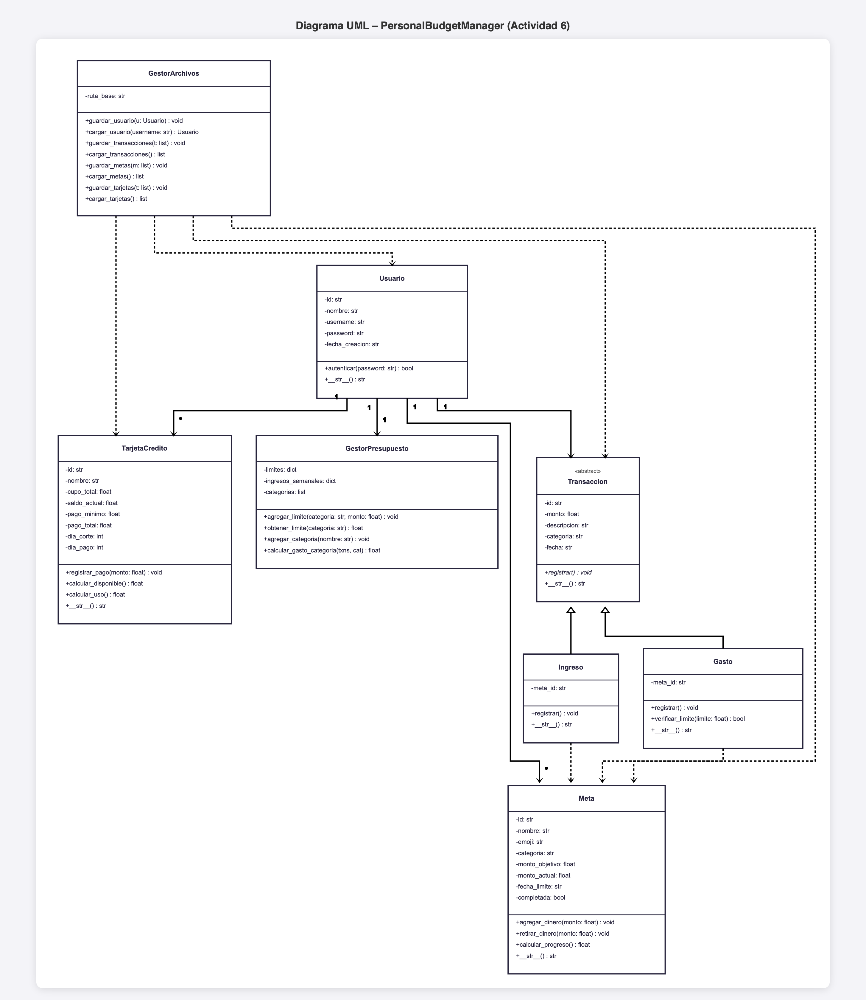

# PersonalBudgetManager

Sistema de gestión de presupuesto personal desarrollado en Python con programación orientada a objetos.

## Diagrama UML



## Estructura del proyecto

```
PersonalBudgetManager/
├── modelos/
│   ├── transaccion.py       # Clase abstracta base
│   ├── ingreso.py           # Hereda de Transaccion
│   ├── gasto.py             # Hereda de Transaccion
│   ├── usuario.py
│   ├── meta.py
│   └── tarjeta_credito.py
├── gestores/
│   ├── gestor_presupuesto.py
│   └── gestor_archivos.py
├── tests/
│   └── test_personal_budget.py
└── main.py
```

## Conceptos aplicados

- Herencia y polimorfismo (`Transaccion` → `Ingreso`, `Gasto`)
- Clases abstractas (`ABC`)
- Encapsulamiento con propiedades
- Persistencia en archivos de texto plano
- Pruebas unitarias con `unittest`
- Principios SOLID

## Pruebas

```bash
python3 -m unittest tests/test_personal_budget.py -v
```
